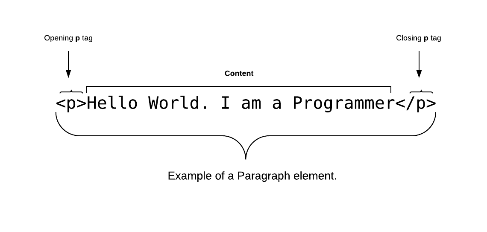

<link rel="stylesheet" href="../../style.css" />

<div style="display: flex; justify-content: space-between; align-items: baseline;">
    
    <h2 style="text-align: left; text-decoration: none; background: none; border-radius: 0; border: none; box-shadow: none; color: #4B5563; font-size: 18px; font-weight: 800; padding-left: 0; margin-top: 10px; text-transform: uppercase">Conquer FreeCodeCamp Course</h2>
    
</div>
<h2 style="text-align: center;  margin-bottom: 30px;">Week-1 Basic HTML & HTML 5 - Recap</h2>


# WHAT IS HTML ?
HTML stands for HyperText Markup Language. Its is a markup language for creating webpages and documents. This means we put our content, that should be visible to the browser inside special keywords called **tags**. 

> * _**HyperText**_ means that it uses the HTTP part of the Internet
> * _**Markup**_ means the code you write is annotated with keywords
> * **_Language_** means it can be read by both a human and a computer

## Creating an HTML file

To create an HTML file, take note of below points:

* You don't need any special server or hosting company to write your HTML. But you will probably need a server if you want to publish your html files on the web
* Open the editor of your choice, in our case Visual Studio Code, create a new file and save it as **index.html**
* HTML files end with **.html** extension.
* HTML files run in the browser. That is you open your HTML files with your browser.


## HTML tags

HTML *tags* are the basic building block of any webpage. HTML documents use *tags* to tell the browser how to format our content. Different Tags format the way that information and text is displayed. 

> Note that HTML tags are not displayed in the browser, they are only read by the browser to know what type of content you’ve written.

**TAGS ARE**: 

* Element names surrounded by angle brackets
* They normally come in pairs, start tag and end tag, eg: *\<h1>Heading 1\</h1>*, *\<p>Some Paragraph\</p>*, though we have some self closing tags, eg: *\, \<br>, \<input>*. 
* The end tag is usually the same but with a **forward slash** (/).
* Some tags close themeselves. These tags are called self-closing tags, and basically they don't have any content within them. Eg: *\<br/>* or *\<br>* in HTML5, *\, \<input>* . Notice that, the slash is after the tag name. But now in HTML5, you don't need to put a slash after the keyword in self closing tags.

## HTML Tag Attributes

All html tags can have attributes. Attributes provide information about an element.

* Attributes are placed within the start tag.
* They are formatted as key/value pairs. Eg: *id="someId"*.

Example:

```html
<h1 title="My Company">My Company Name</h1>
```

## HTML elements

An HTML ELEMENT is the combination of an opening tag ( eg: *\<p>* ), a closing tag ( eg: *\</p>* ) and everything in between the opening and closing tags.

Example:


```html
<p>This is a HTML element and is defined using the paragraph tag</p>
```
This will be ouputted like below in your web browser:

```
This is a HTML element defined using the paragraph tag.
```

### Diagram Showing a Paragraph Element




> Remember
> * use a text editor like VSCode to create HTML documents
> * use a browser like Chrome to open HTML documents

<div style="margin-top: 30px"></div>


## Basic Structure of a typical Web Page

### 1. !DOCTYPE html
When writing a html document, the first thing to write in our code editor is the doctype declaration, written as *\<!DOCTYPE html>*. This provides the web browser with information about the version of HTML in which the page is written in. *\<!DOCTYPE hmtl>* is how we tell our browser that this page is written on HTML5. HTML5 is the latest version of the HTML language.


### 2. html

Immediately after the doctype comes the html element. The *html* element is the **root** element of the document tree and everything that follows is a descendant of that root element.

> The html element breaks the document into two main sections: the *head* and
the *body*.

### 3. head

The *head* element contains meta data. These are information that describes the document itself, or associates it with related resources, such as scripts and style sheets ( CSS ). The head may contains:

* **title**: The title of the document, shown in a browser's title bar or on the page's tab
* **css**: We normally put CSS codes in the head of our HTML document, either embedded or link from an external file.


### 4. body

The body is where the bulk of the page is contained. Everything that you can see in the browser window (or viewport) is contained inside the body element. Things we have in the body are mostly headings, paragraphs, lists, links, images, tables, and etc... The body is also referred as the meat of the webpage.

Example of a typical webpage

```html
<!DOCTYPE html>
<html>
<head>
    <title>My Page Title</title>
</head>
<body>
    <h1>Hello World!</h1>
    <p>I am Modou Lamin Barrow. I live in The Gambia and I am learning how to code at JCC</p>
</body>
</html>
```

## Some common HTML Elements

### h1 (Heading level 1)

```html
<h1>Welcome Message</h1>
```

The *h1* element is used to indicate the most important (or highest-level) heading on the page.

> In total, we have six heading levels to choose from— *h1* to *h6* —to add structure to the web page. *h1* is the highest heading level (and, by default, the largest in terms of font size) and *h6* the lowest (and smallest).

Example

```html
<h1>Welcome to JassehCodeCamp Programming Foundation Course</h1>
```

### p (Paragraph)

The p element is one of the most commonly used building blocks of HTML. When you use the *p* element to begin a new paragraph in HTML, it automatically creates some space above and below the content. This space is applied by the browser’s built-in style sheets, but you can override it as you see fit using CSS.

Example

*p* is used, quite simply, to mark up paragraphs of text:

```html
<p>This is a paragraph of text...</p>
<p>...and this is another paragraph.</p>
```

### br (Line break)

```html
<br/> or <br>
```

The *br* element’s purpose is very simple. It creates a line break within a block of text, leaving no padding or margins between the two blocks of text created by the line break.

> Remember *\<br>* with no forward slash is the HTML5 way, and *\<br />* is before HTML5. Either one works, so it depends on what you prefer.
> 

### img (Image)

```html

```

The img element allows us to add an image on our webpage.

Example

```html

```

#### Diagram Showing an Image Element


<div style="margin-top: 100px"></div>


By Omar Jasseh<br />
Lead Instructor, JCC


<div style="margin-top: 30px"></div>
I hope you enjoyed :) reading this material.

Feel free to shoot me an email to jassehomar99@gmail.com or WhatsApp message to 2203100948 if you found any grammatical or content-based error(s) on this doucment.

<div style="margin-top: 30px"></div>

I do normally share coding tips and resources on a few social platforms. Follow me on:<br>

[Facebook](https://www.facebook.com/jassehomar), [Linkedin](https://www.linkedin.com/in/jassehomar/), [Twitter](https://twitter.com/jassehomar99), or [Github](https://github.com/jassehomar)

to learn from the resources I share with the world.